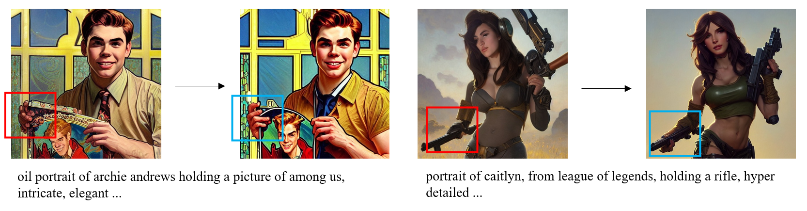
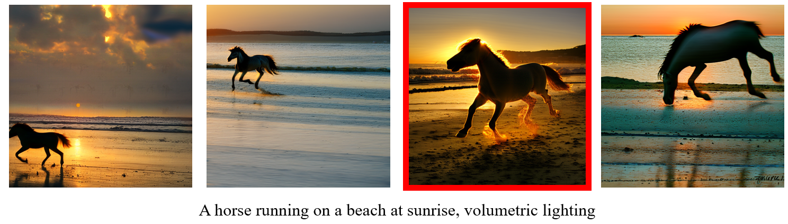
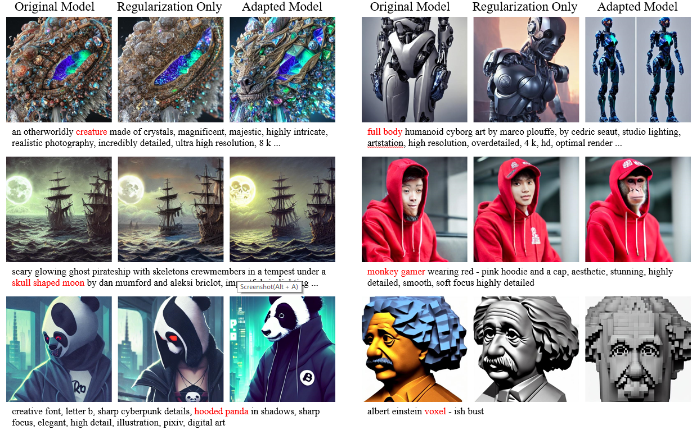
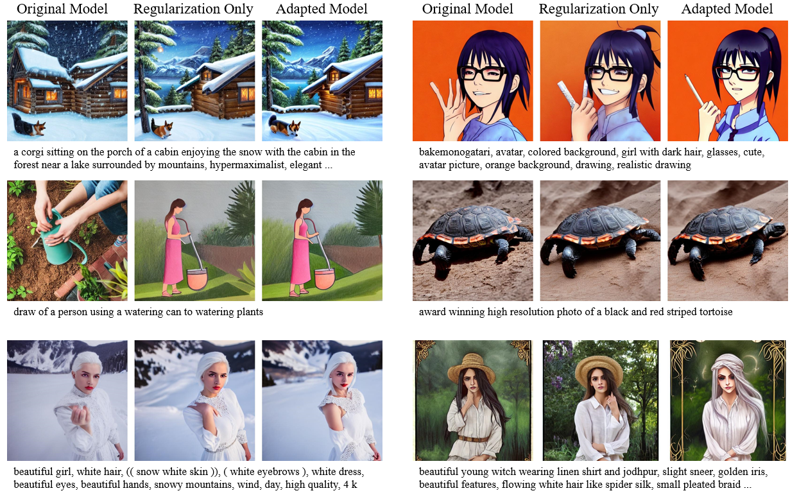

# Better Aligning Text-to-Image Models with Human Preference



### [Project page](https://tgxs002.github.io/align_sd_web/) | [Arxiv](https://arxiv.org/abs/2303.14420)

This is the official repository for the paper: Better Aligning Text-to-Image Models with Human Preference. The paper demonstrates that Stable Diffusion can be improved via learning from human preferences. By learning from human preferences, the model is better aligned with user intentions, and also produce images with less artifacts, such as weird limbs and faces.

## Human preference dataset


The dataset is collected from the Stable Foundation Discord server. We record human choices on images generated with the same prompt but with different random seeds.
The compressed dataset can be downloaded from [here](https://mycuhk-my.sharepoint.com/:u:/g/personal/1155172150_link_cuhk_edu_hk/ESCl7RD3cE9FsitV0P2F8DABC1zRJxbCMI-AXei2Nwx2vA?e=ILRanj).
Once unzipped, you should get a folder with the following structure:
```
dataset
---- preference_images/
-------- {instance_id}_{image_id}.jpg
---- preference_train.json
---- preference_test.json
```
The annotation file, `preference_{train/test}.json`, is organized as:
```
[
    {
        'human_preference': int,
        'prompt': str,
        'id': int,
        'file_path': list[str],
        'user_hash': str,
        'contain_name': boolean,
    },
    ...
]
```
The annotation file contains a list of dict for each instance in our dataset. Besides the image paths, prompt, id and human preference, we also provide the hash of user id. The prompts with names are flagged out by the `contain_name` field.

<!-- data format specification -->

## Human Preference Classifier
The pretrained human preference classifier can be downloaded from [OneDrive](https://mycuhk-my.sharepoint.com/:u:/g/personal/1155172150_link_cuhk_edu_hk/EWDmzdoqa1tEgFIGgR5E7gYBTaQktJcxoOYRoTHWzwzNcw?e=b7rgYW).
Before running the human preference classifier, please make sure you have set up the CLIP environment as specified in the [official repo](https://github.com/openai/CLIP).

```python
import torch
import clip
from PIL import Image

device = "cuda" if torch.cuda.is_available() else "cpu"
model, preprocess = clip.load("ViT-L/14", device=device)
params = torch.load("path/to/hpc.pth")['state_dict']
model.load_state_dict(params)

image1 = preprocess(Image.open("image1.png")).unsqueeze(0).to(device)
image2 = preprocess(Image.open("image2.png")).unsqueeze(0).to(device)
images = torch.cat([image1, image2], dim=0)
text = clip.tokenize(["your prompt here"]).to(device)

with torch.no_grad():
    image_features = model.encode_image(images)
    text_features = model.encode_text(text)

    image_features = image_features / image_features.norm(dim=-1, keepdim=True)
    text_features = text_features / text_features.norm(dim=-1, keepdim=True)

    hps = image_features @ text_features.T
```
Remember to replace `path/to/hpc.pth` with the path of the downloaded checkpoint.
The training script is based on [OpenCLIP](https://github.com/mlfoundations/open_clip). We thank the community for their valuable work.
The script will be released soon.

## Adapted model

### Checkpoint
The LORA checkpoint of the adapted model can be found [here](https://mycuhk-my.sharepoint.com/:u:/g/personal/1155172150_link_cuhk_edu_hk/ETbAtw6J9AdCq-afxHsZT6kBsnWa_mWXStzqyIyu1hxVuQ?e=MnX7tt). We also provide the regularization only model trained without the guidance of human preferences at [here](https://mycuhk-my.sharepoint.com/:u:/g/personal/1155172150_link_cuhk_edu_hk/ESgC8KMIBoZOuGLsBGzu164Bxzwucwp_Jc5xBvTwA9sagA?e=RW4aaV).

### Inference
You will need to have [diffusers](https://huggingface.co/docs/diffusers/index) and [pytorch](https://pytorch.org/) installed in your environment.
After that, please run the following command for inference:
```shell
python generate_images.py --unet_weight /path/to/checkpoint.bin --prompts /path/to/prompt_list.json --folder /path/to/output/folder
```
**We highlight that you need to add 'Weird image. ' to the negative prompt when doing inference**, for which the reason is explained in our paper.
If you want to inference on [AUTOMATIC1111/stable-diffusion-webui](https://github.com/AUTOMATIC1111/stable-diffusion-webui), please check [this issue](https://github.com/tgxs002/align_sd/issues/1).

### Training
Please refer to the paper for the training details. The training script will be released soon.


## Visualizations



## Citation
If you find the work helpful, please cite our paper:
```
@article{wu2023alsd,
  title={Better Aligning Text-to-Image Models with Human Preference},
  author={Xiaoshi Wu and Keqiang Sun and Feng Zhu and Rui Zhao and Hongsheng Li},
  journal={ArXiv},
  year={2023},
  volume={abs/2303.14420}
}
```
